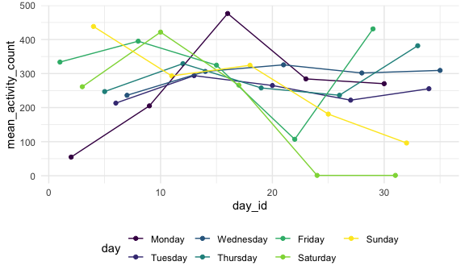

Homework 3
================
Tu Nguyen

This is my solution to HW2.

## Problem 2

Tidy data into “minute of the day” and “activity count” columns

``` r
accel_df = 
  read_csv("./data/accel_data.csv") %>% 
   pivot_longer(
    activity.1:activity.1440,
    names_to = "minute",
    names_prefix = "activity.",
    values_to = "activity_count"
  ) %>% 
  mutate(
    weekday_or_weekend =
      recode(day,
             "Monday" = "weekday",
             "Tuesday" = "weekday",
             "Wednesday" = "weekday",
             "Thursday" = "weekday",
             "Friday" = "weekday",
             "Saturday" = "weekend",
             "Sunday" = "weekend")
  )
```

    ## Parsed with column specification:
    ## cols(
    ##   .default = col_double(),
    ##   day = col_character()
    ## )

    ## See spec(...) for full column specifications.

``` r
accel_df$day = factor(accel_df$day, levels = c("Monday", "Tuesday", "Wednesday", "Thursday", "Friday", "Saturday", "Sunday"))
accel_df[order(accel_df$day), ]
```

    ## # A tibble: 50,400 x 6
    ##     week day_id day    minute activity_count weekday_or_weekend
    ##    <dbl>  <dbl> <fct>  <chr>           <dbl> <chr>             
    ##  1     1      2 Monday 1                   1 weekday           
    ##  2     1      2 Monday 2                   1 weekday           
    ##  3     1      2 Monday 3                   1 weekday           
    ##  4     1      2 Monday 4                   1 weekday           
    ##  5     1      2 Monday 5                   1 weekday           
    ##  6     1      2 Monday 6                   1 weekday           
    ##  7     1      2 Monday 7                   1 weekday           
    ##  8     1      2 Monday 8                   1 weekday           
    ##  9     1      2 Monday 9                   1 weekday           
    ## 10     1      2 Monday 10                  1 weekday           
    ## # … with 50,390 more rows

There are 6 variables which include `week`, `day_id`, `day`, `minute of
the day`, `activity_count`, and `weekday_or_weekend`. There are total
50,400 observations.

``` r
accel_df_tidy = 
  accel_df %>% 
  group_by(week,day_id, day) %>% 
  summarise(
    mean_activity_count = mean(activity_count, na.rm = TRUE)
  )
```

    ## `summarise()` regrouping output by 'week', 'day_id' (override with `.groups` argument)

``` r
accel_df_tidy$day = factor(accel_df_tidy$day, levels = c("Monday", "Tuesday", "Wednesday", "Thursday", "Friday", "Saturday", "Sunday"))
accel_df_tidy[order(accel_df_tidy$day), ]
```

    ## # A tibble: 35 x 4
    ## # Groups:   week, day_id [35]
    ##     week day_id day     mean_activity_count
    ##    <dbl>  <dbl> <fct>                 <dbl>
    ##  1     1      2 Monday                 54.7
    ##  2     2      9 Monday                205. 
    ##  3     3     16 Monday                476. 
    ##  4     4     23 Monday                284. 
    ##  5     5     30 Monday                270. 
    ##  6     1      6 Tuesday               213. 
    ##  7     2     13 Tuesday               294. 
    ##  8     3     20 Tuesday               265. 
    ##  9     4     27 Tuesday               222. 
    ## 10     5     34 Tuesday               255. 
    ## # … with 25 more rows

``` r
accel_df_tidy %>% 
  pivot_wider(
    names_from = day,
    values_from = mean_activity_count
  )
```

    ## # A tibble: 35 x 9
    ## # Groups:   week, day_id [35]
    ##     week day_id Friday Monday Saturday Sunday Thursday Tuesday Wednesday
    ##    <dbl>  <dbl>  <dbl>  <dbl>    <dbl>  <dbl>    <dbl>   <dbl>     <dbl>
    ##  1     1      1   334.   NA        NA     NA       NA      NA        NA 
    ##  2     1      2    NA    54.7      NA     NA       NA      NA        NA 
    ##  3     1      3    NA    NA       261.    NA       NA      NA        NA 
    ##  4     1      4    NA    NA        NA    438.      NA      NA        NA 
    ##  5     1      5    NA    NA        NA     NA      247.     NA        NA 
    ##  6     1      6    NA    NA        NA     NA       NA     213.       NA 
    ##  7     1      7    NA    NA        NA     NA       NA      NA       236.
    ##  8     2      8   395.   NA        NA     NA       NA      NA        NA 
    ##  9     2      9    NA   205.       NA     NA       NA      NA        NA 
    ## 10     2     10    NA    NA       422.    NA       NA      NA        NA 
    ## # … with 25 more rows

Patient’s activity count is high on the weekends during the first 3
weeks. In general, patient is more active during the weekdays.

``` r
ggplot(accel_df_tidy, aes(x = day_id, y = mean_activity_count, color = day)) + 
  geom_point() +
  geom_line()
```



From the graph, patient’s activity counts decreased on Saturdays and
Sundays from day 24 to day 31. Activity count of Fridays decreased from
day 1 to day 22 but increased afterwards. On Tuesdays, Thursdays,and
Friday, activity counts remained around the same pace.

## Problem 3

Load the dataset

``` r
devtools::install_github("p8105/p8105.datasets")
```

    ## Skipping install of 'p8105.datasets' from a github remote, the SHA1 (412759e3) has not changed since last install.
    ##   Use `force = TRUE` to force installation

``` r
library(p8105.datasets)
data("ny_noaa")
```

Data cleaning (separate date, convert prcp to the same unit as snowfall,
convert tmax and tmin to degree C)

``` r
ny_noaa_df = 
  ny_noaa %>% 
  separate(date, into = c("year", "month", "day"), sep = "-")
```

``` r
ny_noaa_df$tmin = as.double(as.character(ny_noaa_df$tmin))
ny_noaa_df$tmax = as.double(as.character(ny_noaa_df$tmax))

ny_noaa_df %>% 
  mutate(
    prcp = prcp * 10,
    tmin = tmin * 10,
    tmax = tmax * 10
  )
```

    ## # A tibble: 2,595,176 x 9
    ##    id          year  month day    prcp  snow  snwd  tmax  tmin
    ##    <chr>       <chr> <chr> <chr> <dbl> <int> <int> <dbl> <dbl>
    ##  1 US1NYAB0001 2007  11    01       NA    NA    NA    NA    NA
    ##  2 US1NYAB0001 2007  11    02       NA    NA    NA    NA    NA
    ##  3 US1NYAB0001 2007  11    03       NA    NA    NA    NA    NA
    ##  4 US1NYAB0001 2007  11    04       NA    NA    NA    NA    NA
    ##  5 US1NYAB0001 2007  11    05       NA    NA    NA    NA    NA
    ##  6 US1NYAB0001 2007  11    06       NA    NA    NA    NA    NA
    ##  7 US1NYAB0001 2007  11    07       NA    NA    NA    NA    NA
    ##  8 US1NYAB0001 2007  11    08       NA    NA    NA    NA    NA
    ##  9 US1NYAB0001 2007  11    09       NA    NA    NA    NA    NA
    ## 10 US1NYAB0001 2007  11    10       NA    NA    NA    NA    NA
    ## # … with 2,595,166 more rows

Most observed values in snowfall

``` r
most_snow = table(ny_noaa_df$snow)
most_snow[most_snow == max(most_snow)]
```

    ##       0 
    ## 2008508

The most observed values in snowfall is 0, which occurs 2008508 times.
Because snow occurs mostly from December to March but for only certain
days.
